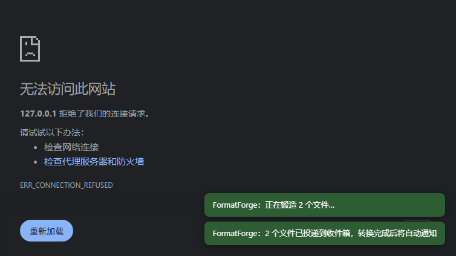
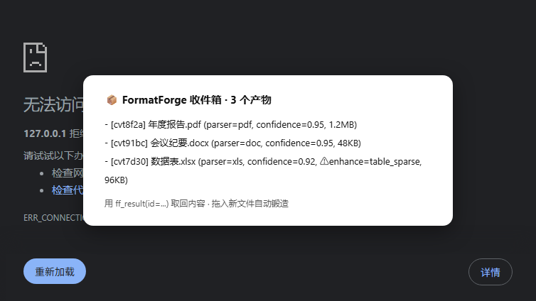
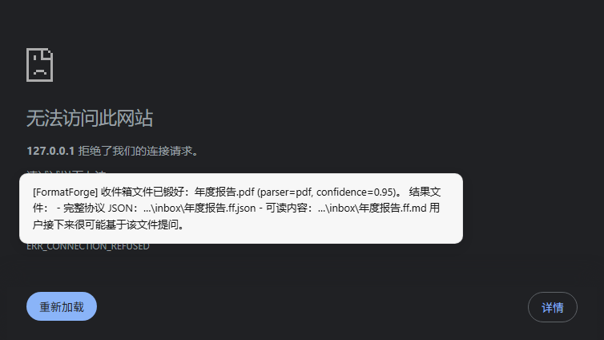

# DSH-FormatForge

**把任意文件拖进 DeepSeek Harness，立刻变成 AI 能读懂的数据。**

[](https://www.npmjs.com/package/@tianbuyu-wwx/dsh-formatforge)
[](https://github.com/Tianbuyu-wwx/DSH-FormatForge/releases)
[](https://github.com/Tianbuyu-wwx/DSH-FormatForge/actions/workflows/ci.yml)
[](https://python.org)
[](https://nodejs.org)
[](LICENSE)

> **v1.0 production-ready**（2026-09）：协议冻结（`packages/dsh-formatforge/protocol/v1/`），向后兼容承诺启用。

DSH-FormatForge 是一个 [DeepSeek Harness](https://github.com/deepseek-ai) 插件：把 PDF、DOCX、PPTX、XLSX、EML、EPUB、TOML 等 **30+ 种格式**锻造成 AI 模型可直接消化的结构化文本——直接**拖进 dsh 网页**，或在对话里粘贴文件路径。

> 项目前身是「Data-Format-Translator / AI 数据转换器」（Web 服务形态，冻结于 `v2.1.0-ci-green`）。
> v3.0 起完全重构为 dsh 插件：无 Web 界面、无内置 AI 客户端，专注「格式 → 结构化数据」这一层。

## 它解决什么问题

dsh 的 `read` 工具读 PDF/DOCX 这类二进制是乱码；官方附件通道只认图片。
装上 FormatForge 后：

```
拖 report.pdf 进 dsh 网页
  → 右下角提示「正在锻造…」
  → 数秒后对话收到通知：report.pdf 已锻好 (parser=pdf, confidence=0.95)
  → 直接基于这份文件继续提问
```

也可以不走拖拽：在对话里粘贴本地路径（`E:\docs\report.docx`），agent 会按约定先调用 `ff_translate` 再回答。





## 安装

> **适配目标：DeepSeek Harness 0.2.0-rc.2**（Electron 桌面版）。
> 0.2.0 起 profile 由应用托管：桌面端用 `desktop` profile，普通 web/tui 用各自 profile。
> 兼容性与安装拒绝规则见 [ADAPTATION_PLAN.md](ADAPTATION_PLAN.md)。

### 前置

| 依赖 | 说明 |
|---|---|
| Python ≥ 3.10 | 运行转换内核；解释器探测顺序 `FF_PYTHON` → `<repo>/.venv-fg` → PATH |
| Node ≥ 22 | dsh 本身的要求 |

### 方式一：从源码安装（本地开发，推荐用于本仓库）

```bash
git clone https://github.com/Tianbuyu-wwx/DSH-FormatForge.git DSH-FormatForge
cd DSH-FormatForge
pip install -e .                 # 或 python -m venv .venv-fg && .venv-fg/Scripts/pip install -e .

# 装进桌面端 profile（0.2.0：add ≠ 激活，重启桌面端才生效）
dsh plugin --profile desktop add "$(pwd)/packages/dsh-formatforge"

# 检查
dsh plugin --profile desktop ls          # 依赖里应出现 @tianbuyu-wwx/dsh-formatforge
python scripts/verify-install.py --skip-inbox   # 重启之后跑，应 ALL GREEN
```

`add` 成功后宿主会把本包**自动追加**进 profile `package.json` 的
`dsh.profile.bundles`（`reconcileProfilePlugins`），无需手工编辑。

**不需要**再跑 junction 修复脚本：0.2.0 的 launcher 为 linked profile 包内建了
peer-aware 解析（`dsh-app-boot::routeLinked()`），`@deepseek-ai/dsh-tools` 等 peer
直接命中宿主运行时那一份。`scripts/rebuild-plugin-junctions.py` 只对 0.1.x 宿主有意义。

### 方式二：从 npm 安装

```bash
npx @deepseek-ai/dsh plugin --profile desktop add @tianbuyu-wwx/dsh-formatforge
# 重启 DeepSeek Harness 生效
```

npm 包只是插件壳，仍需一份可运行的 Python 内核（本仓库）并告知位置：

```bash
# 给法 A：clone 本仓库并安装内核（推荐，含全部解析器依赖）
git clone https://github.com/Tianbuyu-wwx/DSH-FormatForge.git DSH-FormatForge
cd DSH-FormatForge && pip install -e .
setx FF_REPO_ROOT "D:\DSH-FormatForge"

# 给法 B：已有环境？只要它 import 得到 core/parsers：
setx FF_PYTHON "C:\path\to\your\python.exe"
```

### 生效验证

重启后在启动日志里找这一行：

```
[dsh-formatforge v2.0.0] tools registered: ff_translate, ff_formats, ff_result, ff_batch, ff_diff
```

再跑 `python scripts/verify-install.py`（桌面端需 `--token`，见脚本 `--help`）。

## 使用

### 1. 网页拖拽（零学习成本）

把任何支持的文件拖进 dsh 网页任意位置：

- 非图片文件 → 自动上传并锻造，右下角 toast 显示进度与结果
- 图片 → 走 dsh 原生图片附件通道（不受影响）
- 转换完成后活跃会话收到轻量通知，附产物路径

产物落在收件箱目录（默认 `~/.dsh/formatforge/inbox/`）：
`<名字>.ff.md`（可直接阅读）+ `<名字>.ff.json`(完整协议数据)。

### 2. 对话内工具

| 工具 | 用途 |
|---|---|
| `ff_translate` | 转换：`path`（单个）/ `paths`（多个，支持 `*` glob）/ `text` 三选一；`format` json·markdown·html·text；`max_chars`/`offset` 分页；`quality` 附质量报告 |
| `ff_formats` | 列出支持的输入格式矩阵 |

### 3. CLI（脱离 dsh 也能用）

```bash
pip install -e .   # 之后
python -m formatforge translate document.pdf --format markdown
python -m formatforge translate --stdin-text < notes.txt
python -m formatforge formats      # 支持格式矩阵
```

stdout 输出单行协议 JSON（`{ok, code, data:{content, meta, quality?, enhance?}}`），日志走 stderr，退出码 0/2/3/4。

## enhance 协议 —— 模型增强交给会话本身

插件**不带任何 AI 客户端**。当纯规则转换不足以产出高质量结果时，返回里会出现：

```jsonc
"enhance": {
  "needed": true,
  "reason": "image_only",   // image_only | low_confidence | table_sparse
  "hint": "4/4 页无文字层（疑似扫描件）..."
}
```

SKILL.md 会指导当前会话模型：**按 hint 直接用自己的能力完成增强**（如基于 OCR 文本重建表格），不调用任何外部 API。模型永远与 dsh 会话一致，零密钥配置。

## 配置

| 变量 | 默认 | 说明 |
|---|---|---|
| `FF_REPO_ROOT` | 自动探测 | 含 `formatforge/ core/ parsers/` 的仓库根 |
| `FF_PYTHON` | 探测链兜底 PATH | 指定解释器（≥3.10） |
| `FF_MAX_BYTES` | 104857600 | 单文件上限（100MB） |
| `FF_TIMEOUT_S` | 120 | 单次转换超时（秒） |
| `FF_INBOX_NOTIFY` | **false** | 是否把「已锻好」推进会话 transcript。v2.0.1 起默认关：宿主没有临时通知通道，推送只能落成 `user/message`，会被当成用户发言、永久留在上下文里、且只有运行中的会话收得到。收件箱是共享目录，改用 `ff_result {list:true}` 拉取 |
| `FF_HOME` | `$DSH_HOME/formatforge` → `~/.dsh/formatforge` | 收件箱根目录（优先于 `DSH_HOME`） |
| `OCR_ENABLED` | true | 启用本地 OCR（tesseract/paddleocr/easyocr 任一） |

## 架构

```
浏览器拖拽 ──POST /formatforge/upload──┐
                                       ▼
                          ~/.dsh/formatforge/inbox/
                                       │ fs watcher（去重·稳定检测）
对话路径 ── ff_translate ──┐            ▼
CLI     ── python -m … ──► formatforge 内核（30+ 解析器 × 7 策略）
                           │            ▼
                           │    协议 JSON {content, meta, quality?, enhance?}
                           ▼            
                    会话轻量通知（仅元数据，不注全文）
```

- **Python 内核**（`core/` + `parsers/` + `formatforge/`）：格式检测、管线编排、策略选择、质量评分
- **Node bundle**（`packages/dsh-formatforge/`）：工具注册（cordis）、client 拖拽模块、inbox watcher、HTTP 上传路由

## 开发

```bash
pip install -e ".[dev]"
pytest test/                                   # 本地 564 passed（CI 为权威门禁）
ruff check . && ruff format --check .
mypy core/ parsers/ formatforge/
node packages/dsh-formatforge/test-manifest.mjs        # bundle 清单/契约自检
node packages/dsh-formatforge/test-client-bundle.mjs   # client bundle 按宿主方式执行自检
node packages/dsh-formatforge/test-local.mjs           # stub 环境 e2e（需本机 Python）
node packages/dsh-formatforge/test-inbox.mjs           # inbox watcher e2e
node packages/dsh-formatforge/test/test-truncate-consistency.mjs  # JS↔Python 分页一致性
```

设计文档：[PLUGIN_PLAN.md](PLUGIN_PLAN.md)（插件化实施）· [EVOLUTION_PLAN.md](EVOLUTION_PLAN.md)（v0.4–v0.7 演进）· [ROADMAP.md](ROADMAP.md)（后续计划）

## 已知限制

- 扫描件 PDF 无文字层时依赖本机 OCR 引擎；都没有则返回 `enhance=image_only` 提示由会话模型兜底
- 拖拽模块挂在宿主**未导出**的内部实现上（`dsh-client-ui-attachment` 的 document 冒泡期
  drop 监听）：插件用捕获期先手 `stopPropagation` 完成分流。宿主若改到捕获期或 window 级，
  分流会静默失效（插件不会报错，只是拖拽不再被接管）——已用特征检测思路保守实现，但无公开契约。
- 混合粘贴（剪贴板同时含文件与文本）只取文件，文本不会进入输入框——与宿主自身分支的差异是有意为之。
- 上传地址用根绝对路径 `/formatforge/upload`，与宿主注册的 exact 路由一致；若将来宿主支持子路径
  托管，客户端与服务端需要同时改。
- Windows 下以中文路径 `link:` 安装时，profile 里的 `package.json`/`pnpm-lock.yaml` 均为正确 UTF-8，
  但用 PowerShell `Get-Content` 查看可能显示为乱码（控制台编码问题，非文件问题）。

## License

MIT
